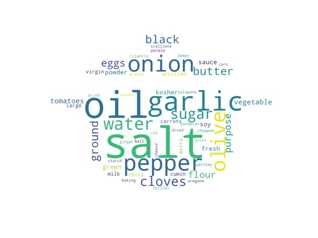
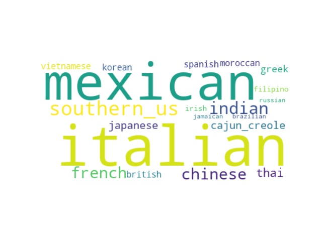

# Chef-ish
A naive attempt to cook with dataset of recipes

Updates:
2018-11-07

Obtained word cloud for both cuisines and ingredients. Started on Naive Bayes classifier.

2018-10-31

Data loaded, playing with wordCould

